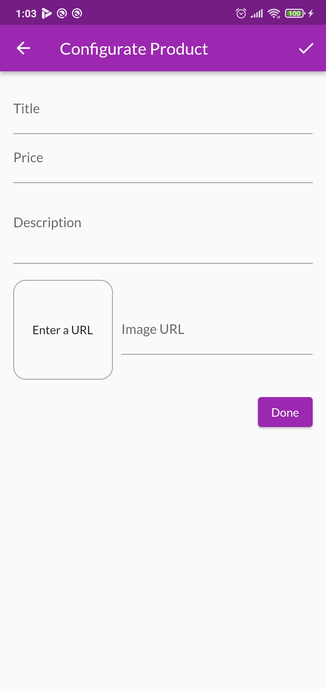

# shop_app

Highlight: 🤖
- [Firebase: Realtime Database][0]
- State Management: [provider 6.0.3][1]
- User Authentication
- Animation (Updating)

Feature: 🍁
- Make favorite products
- Add product to cart
- Swipe item to remove it from cart
- Checkout cart
- View order history
- Add, remove, edit your own products

## Screenshots

- Overview

    
    
    

- Drawer

    

- Add, edit, remove

    
    
    

---

[0]: https://firebase.google.com/
[1]: https://pub.dev/packages/provider

